# AI Policy & Product Helper

A local-fir## LLM Provider Options

**OpenAI (Recommended for testing)**:
```bash
# Set LLM_PROVIDER=openai in .env
docker compose up --build  # Fast startup, no model downloads
```

**Ollama (Local LLM)**:
```bash  
# Set LLM_PROVIDER=ollama in .env
docker compose --profile ollama up --build  # Includes ~2GB model download
```

**Offline/Stub mode**:
```bash
# Set LLM_PROVIDER=stub in .env - fully local, deterministic responses
docker compose up --build
```RAG starter with **FastAPI** (backend), **Next.js** (frontend), and **Qdrant** (vector DB). Runs with one command using Docker Compose.


## Quick start

1) **Copy `.env.example` → `.env`** and edit as needed.

2) **Run everything**:

**Production mode** (for deployment/testing):
```bash
docker compose up -d
```

**Development mode** (with hot reload for coding):
```bash
docker compose -f docker-compose.yml -f docker-compose.dev.yml up -d
```

**Stop everything**:
```bash
docker compose down
```

**Important: Changing environment variables**:
When modifying `.env` file (e.g., switching LLM providers), Docker Compose caches the old values. Always use:
```bash
docker compose down
docker compose --profile ollama up --build -d  # (or without --profile for other providers)
```
**Never use** `docker compose restart` as it doesn't reload environment variables.

- Frontend: http://localhost:3000  
- Backend:  http://localhost:8000/docs  
- Qdrant:   http://localhost:6333 (UI)

3) **Ingest sample docs** (from the UI Admin tab) or:
```bash
curl -X POST http://localhost:8000/api/ingest
```

4) **Ask a question**:
```bash
curl -X POST http://localhost:8000/api/ask -H 'Content-Type: application/json' \
  -d '{"query":"What’s the shipping SLA to East Malaysia for bulky items?"}'
```

## Offline-friendly
- If you **don’t** set an API key, the backend uses a **deterministic stub LLM** and a **built-in embedding** to keep everything fully local.
- If you set `OPENAI_API_KEY` (or configure Ollama), the backend will use real models automatically.

## Project layout
```
ai-policy-helper/
├─ backend/
│  ├─ app/
│  │  ├─ main.py          # FastAPI app + endpoints
│  │  ├─ settings.py      # config/env
│  │  ├─ rag.py           # embeddings, vector store, retrieval, generation
│  │  ├─ models.py        # pydantic models
│  │  ├─ ingest.py        # doc loader & chunker
│  │  ├─ __init__.py
│  │  └─ tests/
│  │     ├─ conftest.py
│  │     └─ test_api.py
│  ├─ requirements.txt
│  └─ Dockerfile
├─ frontend/
│  ├─ app/
│  │  ├─ page.tsx         # chat UI
│  │  ├─ layout.tsx
│  │  └─ globals.css
│  ├─ components/
│  │  ├─ Chat.tsx
│  │  └─ AdminPanel.tsx
│  ├─ lib/api.ts
│  ├─ package.json
│  ├─ tsconfig.json
│  ├─ next.config.js
│  └─ Dockerfile
├─ data/                  # sample policy docs
├─ docker-compose.yml
├─ Makefile
└─ .env.example
```

## Architecture & Design

### System Overview

```mermaid
graph TB
    subgraph "Frontend (Next.js)"
        A[Chat Interface]
        B[Admin Panel]
    end
    
    subgraph "Backend (FastAPI)"
        C[RAG Engine]
        D[Document Ingestion]
        E[API Endpoints]
    end
    
    subgraph "Storage"
        F[Qdrant Vector DB]
        G[Data Directory<br/>(/data/*.md)]
    end
    
    subgraph "External Services"
        H[OpenAI API<br/>(Optional)]
        I[Ollama<br/>(Optional)]
    end
    
    A --> E
    B --> E
    E --> C
    E --> D
    D --> F
    C --> F
    C --> H
    C --> I
    G --> D
    
    style A fill:#e1f5fe
    style B fill:#e1f5fe
    style C fill:#f3e5f5
    style D fill:#f3e5f5
    style F fill:#e8f5e8
    style G fill:#fff3e0
```

### Data Flow

#### Document Ingestion Flow

```mermaid
flowchart LR
    A[📁 /data/*.md files] --> B[📝 Document Loader]
    B --> C[✂️ Text Chunking]
    C --> D[🔢 Generate Embeddings]
    D --> E[💾 Store in Qdrant]
    
    style A fill:#fff3e0
    style E fill:#e8f5e8
```


#### Query Processing Flow

```mermaid
flowchart LR
    A[💬 User Question] --> B[🔍 Vector Search]
    B --> C[📊 Retrieve Chunks]
    C --> D[🤖 LLM Generation]
    D --> E[📋 Answer + Citations]
    
    style A fill:#e1f5fe
    style E fill:#e1f5fe
```


### Key Components

#### RAG Engine (`backend/app/rag.py`)
- **LocalEmbedder**: Deterministic hash-based embeddings (384d) for reproducible results
- **QdrantStore/InMemoryStore**: Vector storage with fallback capability
- **StubLLM/OpenAILLM/OllamaLLM**: Configurable LLM providers

#### Frontend (`frontend/components/`)
- **Chat.tsx**: Question input + conversation history + expandable citations
- **AdminPanel.tsx**: Document ingestion + metrics display + system controls

### Design Trade-offs

#### Local-First vs Cloud-First
**✅ Chosen: Local-First**
- **Pros**: No API costs, works offline, deterministic testing, data privacy
- **Cons**: Limited model capabilities, slower performance than cloud LLMs
- **Decision**: Perfect for development/demos, easily switchable to OpenAI for production

#### Vector Store: Qdrant vs In-Memory
**✅ Chosen: Qdrant with In-Memory fallback**
- **Pros**: Production-ready, persistent, scales well, great UI for debugging
- **Cons**: Additional dependency, Docker complexity
- **Decision**: Best of both worlds - robust for production, graceful fallback for development

#### Frontend: Server-Side vs Client-Side
**✅ Chosen: Next.js with Client Components**
- **Pros**: Fast development, good DX, handles state well for chat interface
- **Cons**: Could be simpler with pure server-side rendering
- **Decision**: Chat interfaces need client state; Next.js provides good balance

#### Citation Strategy: Metadata vs Full-Text
**✅ Chosen: Metadata-based with chunk expansion**
- **Pros**: Clean UI, expandable details, preserves source context
- **Cons**: More complex than simple highlighting
- **Decision**: Better UX for policy documents where context matters

### Production Considerations

#### Next Steps for Production Deployment
1. **Switch to OpenAI API** for better answer quality
2. **Add authentication** and user management
3. **Implement rate limiting** and request throttling
4. **Add monitoring** (Prometheus/Grafana) for RAG metrics
5. **Scale vector storage** with Qdrant clustering
6. **Add caching** for frequently asked questions
7. **Implement CI/CD** with automated testing and deployment

#### Performance Optimizations
- **Batch embedding generation** for large document sets
- **Semantic caching** to avoid repeated LLM calls
- **Async processing** for document ingestion
- **Connection pooling** for database operations

#### Security & Compliance
- **Input sanitization** for user queries
- **Output filtering** to prevent prompt injection
- **Audit logging** for all RAG operations
- **Document access controls** based on user roles

## Development Workflow

### Setup Make (Build Tool)

**macOS/Linux**: Make is already installed ✅

**Windows**: Install Make using one of these options:
```bash
# Option 1: Using Chocolatey
choco install make

# Option 2: Using Scoop
scoop install make

# Option 3: Using winget
winget install GnuWin32.Make
```

### Available Commands

Our project uses **Make** to simplify common tasks. Instead of typing long Docker commands, you can use these shortcuts:

```bash
# Start development environment (with hot reload)
make dev
# → Runs: docker compose -f docker-compose.yml -f docker-compose.dev.yml up -d

# Start production environment (for testing/deployment)
make prod
# → Runs: docker compose up --build -d

# Run all tests (detailed output)
make test  
# → Runs: docker compose exec backend bash -c "cd /app && PYTHONPATH=/app pytest -v"

# Format code automatically (fixes formatting issues)
make fmt
# → Runs: docker compose exec backend black app

# Run complete check (format + test)
make check
# → Runs: make fmt && make test

# Pre-commit workflow (run before committing code)
make pre-commit
# → Same as make check, ensures code is ready to commit
```

### Manual Commands (If you don't want to use Make)

If you prefer to run commands directly:

```bash
# Start development
docker compose up --build -d

# Run tests
docker compose exec backend bash -c "cd /app && PYTHONPATH=/app pytest -v"

# Format code
docker compose exec backend black app
```

### Recommended Development Workflow

1. **Start development environment**: `make dev` (includes hot reload)
2. **Make your changes** to the code (changes auto-reload)
3. **Before committing**: `make pre-commit`
   - This will automatically format your code
   - Run all tests
   - If anything fails, fix the issues and run again
4. **Commit your changes**: `git add . && git commit -m "your message"`

### For Testing/Production

- **Production build**: `make prod` (builds and starts production containers)
- **Testing**: Always use the development environment for faster iteration

### Test Coverage
- **Health & Metrics**: API endpoint validation
- **Full Workflow**: Document ingestion → question answering  
- **Acceptance Criteria**: Required blender and shipping questions
- **Error Handling**: Invalid requests, edge cases
- **Performance**: Response time benchmarks

**Note**: Tests take ~4 minutes due to Ollama LLM being slow (~20s/query). With OpenAI, they run much faster.

## Notes
- Keep it simple. For take-home, focus on correctness, citations, and clean code.

---

## Candidate Instructions (Read Me First)

### Goal
Build a local-first **Policy & Product Helper** using RAG that:
- Ingests the sample docs under `/data`
- Answers questions with **citations** (title + section)
- Exposes metrics and health endpoints
- Provides a minimal **chat UI** and **admin panel**

You have **48 hours** once you start. AI coding tools are allowed.

### Deliverables
1. **GitHub repo link** with your changes.
2. **README** describing setup, architecture, trade-offs, and what you’d ship next.
3. **2–5 minute screen capture** demonstrating ingestion + Q&A + citations.
4. **Tests**: show how to run them and their results (e.g., `pytest -q`).

### Acceptance Checks (we will run)
1. `docker compose up --build` boots **Qdrant + backend + frontend**.
2. Use Admin tab to **ingest** docs without errors.
3. Ask: *“Can a customer return a damaged blender after 20 days?”* → cites **Returns_and_Refunds.md** and **Warranty_Policy.md**.
4. Ask: *“What’s the shipping SLA to East Malaysia for bulky items?”* → cites **Delivery_and_Shipping.md** (mentions bulky item surcharge).
5. Expand a citation chip and see the underlying chunk text.

### Rubric (100 pts)
- **Functionality & correctness (35)** — ingestion, RAG with citations, metrics, health.
- **Code quality & structure (20)** — small functions, separation of concerns, typing, linting.
- **Reproducibility & docs (15)** — clear README, env.example, diagrams.
- **UX & DX polish (10)** — responsive, accessible, solid loading/errors.
- **Testing (10)** — meaningful unit/integration tests that run locally.
- **Performance & observability (10)** — reasonable latency, useful metrics/logs.

### How to Run (Docker)
```bash
# copy env
cp .env.example .env

# run all services
docker compose up --build

# endpoints
# frontend: http://localhost:3000
# backend swagger: http://localhost:8000/docs
# qdrant ui: http://localhost:6333
```

### How to Run (No Docker, optional)
Backend:
```bash
python -m venv .venv && source .venv/bin/activate
pip install -r backend/requirements.txt
uvicorn app.main:app --host 0.0.0.0 --port 8000 --app-dir backend
```
Frontend:
```bash
cd frontend
npm install
npm run dev
# open http://localhost:3000
```

### Switching LLMs
- Default is **stub** (deterministic, offline).
- To use OpenAI: set `LLM_PROVIDER=openai` and `OPENAI_API_KEY` in `.env`. (You are required to demo with OpenAI, API key is provided)
- To use Ollama: set `LLM_PROVIDER=stub` (keep stub) or extend `rag.py` to add an `OllamaLLM` class.
- Please document any changes you make.

### Vector Store
- Default is **Qdrant** via Docker. Fallback is in-memory if Qdrant isn’t available.
- To switch to in-memory explicitly: `VECTOR_STORE=memory` in `.env`.

### API Reference
- `POST /api/ingest` → `{ indexed_docs, indexed_chunks }`
- `POST /api/ask` body:
  ```json
  { "query": "What's the refund window for Category A?", "k": 4 }
  ```
  Response includes `answer`, `citations[]`, `chunks[]`, `metrics`.
- `GET /api/metrics` → counters + avg latencies
- `GET /api/health` → `{ "status": "ok" }`

### UI Walkthrough
1. Open **http://localhost:3000**.
2. In **Admin** card, click **Ingest sample docs** and then **Refresh metrics**.
3. In **Chat**, ask questions. Click the **source badges** to expand supporting chunks.

### What You Can Modify
- Anything. Improve chunking, reranking (MMR), prompt, UI polish, streaming, caching, guardrails (PDPA masking), feedback logging, small eval script, etc.
- Keep the one-command run and README accurate.

### Constraints & Notes
- Keep keys out of the frontend.
- Validate file types if you extend ingestion to uploads.
- Provide small architecture diagram if you can (ASCII is fine).

### Troubleshooting
- **Qdrant healthcheck failing**: ensure port `6333` is free; re-run compose.
- **CORS**: CORS is configured to `*` in `main.py` for local dev.
- **Embeddings/LLM**: With no keys, stub models run by default so the app always works.

### Submission
- Share GitHub repo link + your short demo video.
- Include any notes on trade-offs and next steps.
