# 🤖 AI Policy & Product Helper

A local-first RAG (Retrieval-Augmented Generation) system for customer sup## 📊 API Reference

### Core Endpoints

```bash
# Ingest documents
POST /api/ingest
# Returns: { indexed_docs, indexed_chunks }

# Ask questions  
POST /api/ask
# Body: { "query": "Your question here", "k": 4 }
# Returns: { answer, citations[], chunks[], metrics }

# System status
GET /api/health  # { "status": "ok" }
GET /api/metrics # Counters + performance data
```

### Example Usage

```bash
# Test ingestion
curl -X POST http://localhost:8000/api/ingest

# Ask a question
curl -X POST http://localhost:8000/api/ask \
  -H 'Content-Type: application/json' \
  -d '{"query":"What is the return policy for damaged products?"}'
```t queries. Built with **FastAPI** (backend), **Next.js** (frontend), and **Qdrant** (vector database). 

**⚡ Get started in 60 seconds:**

```bash
# 1. Clone and setup
git clone <your-repo-url>
cd ai-policy-helper-starter-pack

# 2. Configure (optional - works without API keys)
cp .env.example .env
# Edit .env to add OPENAI_API_KEY if desired

# 3. Run everything
docker compose up --build

# 4. Open http://localhost:3000 and click "Ingest sample docs"
```

## ✨ Features

- 🔍 **Smart Document Search**: Vector-based retrieval with citations
- 💬 **Interactive Chat**: Clean UI with source document references  
- 🏠 **Fully Local**: Works offline with built-in embeddings and stub LLM
- ☁️ **Cloud Ready**: Optional OpenAI integration for better responses
- 🐳 **One-Command Setup**: Docker Compose handles everything
- 📱 **Responsive Design**: Works on desktop and mobile


## 🚀 Quick Start

### Prerequisites
- Docker and Docker Compose
- Git

### 1. Setup (30 seconds)
```bash
git clone <your-repo-url>
cd ai-policy-helper-starter-pack
cp .env.example .env
```

### 2. Launch (2-3 minutes)
```bash
docker compose up --build
```

### 3. Use the Application
- **Frontend**: http://localhost:3000
- **Backend API**: http://localhost:8000/docs  
- **Vector DB UI**: http://localhost:6333

### 4. Test the System
1. Click **"Ingest sample docs"** in the Admin panel
2. Try these test questions:
   - *"Can a customer return a damaged blender after 20 days?"*
   - *"What's the shipping SLA to East Malaysia for bulky items?"*

**That's it!** 🎉 The system works entirely offline with no API keys required.

## 🔧 Configuration Options

### LLM Providers

**Option 1: Offline/Stub (Default - No setup needed)**
```bash
# Already configured in .env.example
LLM_PROVIDER=stub
```

**Option 2: OpenAI (Recommended for better responses)**
```bash
# Edit .env file:
LLM_PROVIDER=openai
OPENAI_API_KEY=your-api-key-here

# Restart:
docker compose down && docker compose up --build
```

**Option 3: Local Ollama**
```bash
# Edit .env file:
LLM_PROVIDER=ollama

# Launch with Ollama (includes ~2GB model download):
docker compose --profile ollama up --build
```

## 🛠️ Development Commands

```bash
# Development mode (hot reload)
make dev

# Stop all services  
make down-all

# Run tests
make test

# View all available commands
make
```

## 🔧 Troubleshooting

### Quick Health Check
```bash
# Check if everything is working
curl http://localhost:8000/api/health

# View service status
docker compose ps

# Check configuration
make env-check
```

### Common Issues

**Services won't start:**
```bash
# Clean restart
make down-all
make dev
```

**Environment changes not applying:**
```bash
# Docker caches .env - always restart after changes
docker compose down
docker compose up --build
```

**Port conflicts:**
- Frontend (3000), Backend (8000), Qdrant (6333) must be free
- Stop conflicting services or change ports in docker-compose.yml

**API connection issues:**
- Check `NEXT_PUBLIC_API_BASE=http://localhost:8000` in .env
- Ensure backend is healthy: `curl http://localhost:8000/api/health`

## Offline-friendly
- If you **don’t** set an API key, the backend uses a **deterministic stub LLM** and a **built-in embedding** to keep everything fully local.
- If you set `OPENAI_API_KEY` (or configure Ollama), the backend will use real models automatically.

## 📁 Project Structure

```
ai-policy-helper-starter-pack/
├── 🚀 Quick Start Files
│   ├── docker-compose.yml     # One-command setup
│   ├── Makefile              # Development shortcuts
│   └── .env.example          # Configuration template
│
├── 🔧 Backend (FastAPI)
│   └── backend/
│       ├── app/
│       │   ├── main.py       # API endpoints
│       │   ├── rag.py        # RAG engine & LLM providers
│       │   ├── ingest.py     # Document processing
│       │   ├── models.py     # Data models
│       │   ├── settings.py   # Configuration
│       │   └── tests/        # Test suite (12 tests)
│       ├── requirements.txt
│       └── Dockerfile
│
├── 🎨 Frontend (Next.js)
│   └── frontend/
│       ├── app/
│       │   ├── page.tsx      # Main application
│       │   ├── layout.tsx    # App layout
│       │   └── globals.css   # Styling
│       ├── components/
│       │   ├── Chat.tsx      # Chat interface
│       │   └── AdminPanel.tsx # Admin controls
│       └── lib/api.ts        # API client
│
└── 📄 Sample Data
    └── data/                 # 6 policy documents
        ├── Returns_and_Refunds.md
        ├── Warranty_Policy.md
        ├── Delivery_and_Shipping.md
        └── ...
```

## Architecture & Design

### System Overview


### Data Flow

#### Document Ingestion Flow

```mermaid
flowchart LR
    A[📁 /data/*.md files] --> B[📝 Document Loader]
    B --> C[✂️ Text Chunking]
    C --> D[🔢 Generate Embeddings]
    D --> E[💾 Store in Qdrant]
    
    style A fill:#fff3e0
    style E fill:#e8f5e8
```


#### Query Processing Flow

```mermaid
flowchart LR
    A[💬 User Question] --> B[🔍 Vector Search]
    B --> C[📊 Retrieve Chunks]
    C --> D[🤖 LLM Generation]
    D --> E[📋 Answer + Citations]
    
    style A fill:#e1f5fe
    style E fill:#e1f5fe
```


### Key Components

#### RAG Engine (`backend/app/rag.py`)
- **LocalEmbedder**: Deterministic hash-based embeddings (384d) for reproducible results
- **QdrantStore/InMemoryStore**: Vector storage with fallback capability
- **StubLLM/OpenAILLM/OllamaLLM**: Configurable LLM providers

#### Frontend (`frontend/components/`)
- **Chat.tsx**: Question input + conversation history + expandable citations
- **AdminPanel.tsx**: Document ingestion + metrics display + system controls

### Design Trade-offs

#### Local-First vs Cloud-First
**✅ Chosen: Local-First**
- **Pros**: No API costs, works offline, deterministic testing, data privacy
- **Cons**: Limited model capabilities, slower performance than cloud LLMs
- **Decision**: Perfect for development/demos, easily switchable to OpenAI for production

#### Vector Store: Qdrant vs In-Memory
**✅ Chosen: Qdrant with In-Memory fallback**
- **Pros**: Production-ready, persistent, scales well, great UI for debugging
- **Cons**: Additional dependency, Docker complexity
- **Decision**: Best of both worlds - robust for production, graceful fallback for development

#### Frontend: Server-Side vs Client-Side
**✅ Chosen: Next.js with Client Components**
- **Pros**: Fast development, good DX, handles state well for chat interface
- **Cons**: Could be simpler with pure server-side rendering
- **Decision**: Chat interfaces need client state; Next.js provides good balance

#### Citation Strategy: Metadata vs Full-Text
**✅ Chosen: Metadata-based with chunk expansion**
- **Pros**: Clean UI, expandable details, preserves source context
- **Cons**: More complex than simple highlighting
- **Decision**: Better UX for policy documents where context matters

### Production Considerations

#### Next Steps for Production Deployment
1. **Switch to OpenAI API** for better answer quality
2. **Add authentication** and user management
3. **Implement rate limiting** and request throttling
4. **Add monitoring** (Prometheus/Grafana) for RAG metrics
5. **Scale vector storage** with Qdrant clustering
6. **Add caching** for frequently asked questions
7. **Implement CI/CD** with automated testing and deployment

#### Performance Optimizations
- **Batch embedding generation** for large document sets
- **Semantic caching** to avoid repeated LLM calls
- **Async processing** for document ingestion
- **Connection pooling** for database operations

#### Security & Compliance
- **Input sanitization** for user queries
- **Output filtering** to prevent prompt injection
- **Audit logging** for all RAG operations
- **Document access controls** based on user roles

## Development Workflow

### Setup Make (Build Tool)

**macOS/Linux**: Make is already installed ✅

**Windows**: Install Make using one of these options:
```bash
# Option 1: Using Chocolatey
choco install make

# Option 2: Using Scoop
scoop install make

# Option 3: Using winget
winget install GnuWin32.Make
```

### Available Commands

Our project uses **Make** to simplify common tasks. Instead of typing long Docker commands, you can use these shortcuts:

```bash
# Development Environment (with hot reload)
make dev
# → Runs: docker compose -f docker-compose.yml -f docker-compose.dev.yml up -d

# Development Environment with Ollama (local LLM)
make dev-ollama  
# → Runs: docker compose -f docker-compose.yml -f docker-compose.dev.yml --profile ollama up -d

# Production Environment
make prod
# → Runs: docker compose up --build -d

# Production Environment with Ollama (local LLM)
make prod-ollama
# → Runs: docker compose --profile ollama up --build -d

# Run all tests (detailed output)
make test  
# → Runs: docker compose exec backend bash -c "cd /app && PYTHONPATH=/app pytest -v"

# Format code automatically (fixes formatting issues)
make fmt
# → Runs: docker compose exec backend black app

# Run complete check (format + test)
make check
# → Runs: make fmt && make test

# Pre-commit workflow (run before committing code)
make pre-commit
# → Same as make check, ensures code is ready to commit
```

### Manual Commands (If you don't want to use Make)

If you prefer to run commands directly:

```bash
# Start development
docker compose up --build -d

# Run tests
docker compose exec backend bash -c "cd /app && PYTHONPATH=/app pytest -v"

# Format code
docker compose exec backend black app
```

### Recommended Development Workflow

#### Choose Your LLM Provider

**Option 1: Fast Development (Stub LLM)**
```bash
# Set LLM_PROVIDER=stub in .env
make dev  # Fast startup, deterministic responses
```

**Option 2: Local LLM (Ollama)**
```bash
# Set LLM_PROVIDER=ollama in .env  
make dev-ollama  # Includes ~2GB model download on first run
```

**Option 3: OpenAI (Best Quality)**
```bash
# Set LLM_PROVIDER=openai and OPENAI_API_KEY in .env
make dev  # Fast startup, requires API key
```

#### Development Steps
1. **Start development environment** with your chosen LLM option
2. **Make your changes** to the code (changes auto-reload)
3. **Before committing**: `make pre-commit`
   - This will automatically format your code
   - Run all tests
   - If anything fails, fix the issues and run again
4. **Commit your changes**: `git add . && git commit -m "your message"`

### For Testing/Production

- **Production build**: `make prod` or `make prod-ollama`
- **Testing**: Always use the development environment for faster iteration

### Test Coverage
- **Health & Metrics**: API endpoint validation
- **Full Workflow**: Document ingestion → question answering  
- **Acceptance Criteria**: Required blender and shipping questions
- **Error Handling**: Invalid requests, edge cases
- **Performance**: Response time benchmarks

**Note**: Tests take ~4 minutes due to Ollama LLM being slow (~20s/query). With OpenAI, they run much faster.

---

# 📋 Original Assignment Instructions

> **Note:** The sections below contain the original take-home assignment instructions. 
> The application is fully completed and ready to use with the Quick Start guide above.

## Assignment Overview

### Goal
Build a local-first **Policy & Product Helper** using RAG that:
- Ingests the sample docs under `/data`
- Answers questions with **citations** (title + section)
- Exposes metrics and health endpoints
- Provides a minimal **chat UI** and **admin panel**

You have **48 hours** once you start. AI coding tools are allowed.

### Deliverables
1. **GitHub repo link** with your changes.
2. **README** describing setup, architecture, trade-offs, and what you’d ship next.
3. **2–5 minute screen capture** demonstrating ingestion + Q&A + citations.
4. **Tests**: show how to run them and their results (e.g., `pytest -q`).

### Acceptance Checks (we will run)
1. `docker compose up --build` boots **Qdrant + backend + frontend**.
2. Use Admin tab to **ingest** docs without errors.
3. Ask: *“Can a customer return a damaged blender after 20 days?”* → cites **Returns_and_Refunds.md** and **Warranty_Policy.md**.
4. Ask: *“What’s the shipping SLA to East Malaysia for bulky items?”* → cites **Delivery_and_Shipping.md** (mentions bulky item surcharge).
5. Expand a citation chip and see the underlying chunk text.

### Rubric (100 pts)
- **Functionality & correctness (35)** — ingestion, RAG with citations, metrics, health.
- **Code quality & structure (20)** — small functions, separation of concerns, typing, linting.
- **Reproducibility & docs (15)** — clear README, env.example, diagrams.
- **UX & DX polish (10)** — responsive, accessible, solid loading/errors.
- **Testing (10)** — meaningful unit/integration tests that run locally.
- **Performance & observability (10)** — reasonable latency, useful metrics/logs.

### How to Run (Docker)
```bash
# copy env
cp .env.example .env

# run all services
docker compose up --build

# endpoints
# frontend: http://localhost:3000
# backend swagger: http://localhost:8000/docs
# qdrant ui: http://localhost:6333
```

### How to Run (No Docker, optional)
Backend:
```bash
python -m venv .venv && source .venv/bin/activate
pip install -r backend/requirements.txt
uvicorn app.main:app --host 0.0.0.0 --port 8000 --app-dir backend
```
Frontend:
```bash
cd frontend
npm install
npm run dev
# open http://localhost:3000
```

### Switching LLMs
- Default is **stub** (deterministic, offline).
- To use OpenAI: set `LLM_PROVIDER=openai` and `OPENAI_API_KEY` in `.env`. (You are required to demo with OpenAI, API key is provided)
- To use Ollama: set `LLM_PROVIDER=stub` (keep stub) or extend `rag.py` to add an `OllamaLLM` class.
- Please document any changes you make.

### Vector Store
- Default is **Qdrant** via Docker. Fallback is in-memory if Qdrant isn’t available.
- To switch to in-memory explicitly: `VECTOR_STORE=memory` in `.env`.

### API Reference
- `POST /api/ingest` → `{ indexed_docs, indexed_chunks }`
- `POST /api/ask` body:
  ```json
  { "query": "What's the refund window for Category A?", "k": 4 }
  ```
  Response includes `answer`, `citations[]`, `chunks[]`, `metrics`.
- `GET /api/metrics` → counters + avg latencies
- `GET /api/health` → `{ "status": "ok" }`

### UI Walkthrough
1. Open **http://localhost:3000**.
2. In **Admin** card, click **Ingest sample docs** and then **Refresh metrics**.
3. In **Chat**, ask questions. Click the **source badges** to expand supporting chunks.

### What You Can Modify
- Anything. Improve chunking, reranking (MMR), prompt, UI polish, streaming, caching, guardrails (PDPA masking), feedback logging, small eval script, etc.
- Keep the one-command run and README accurate.

### Constraints & Notes
- Keep keys out of the frontend.
- Validate file types if you extend ingestion to uploads.
- Provide small architecture diagram if you can (ASCII is fine).

### Troubleshooting

#### Quick Diagnostics
```bash
# Check system health and configuration
curl -s http://localhost:8000/api/health

# Check environment setup
make env-check

# View service status
docker compose ps

# Alternative: Use browser for formatted JSON
# Visit: http://localhost:8000/api/health
```

#### Common Issues

**🔧 Environment Setup**
- **Missing .env file**: Run `make setup` to create from template
- **Invalid API keys**: Check `make env-check` for validation warnings
- **Configuration errors**: Visit `/api/health` for detailed config status

**🚀 Service Health**
- **Qdrant healthcheck failing**: Ensure port `6333` is free; run `make down && make dev`
- **Ollama unhealthy**: New containers may take 30s for health check, this is normal
- **Backend errors**: Check `docker compose logs backend` for detailed error messages

**🤖 LLM Provider Issues**
- **OpenAI authentication errors**: Gracefully handled with clear error messages
- **Ollama connection issues**: Ensure `make dev-ollama` was used, not just `make dev`
- **Stub mode**: Always works as fallback - no external dependencies

**🔄 Environment Changes**
```bash
# After changing .env file, always restart with rebuild:
make down-all  # Stops everything including Ollama
make dev       # or make dev-ollama
```

**📱 Frontend/CORS**
- **CORS issues**: Configured to `*` in `main.py` for local development
- **API connection**: Check `NEXT_PUBLIC_API_BASE` in `.env` matches backend URL

### Submission
- Share GitHub repo link + your short demo video.
- Include any notes on trade-offs and next steps.
